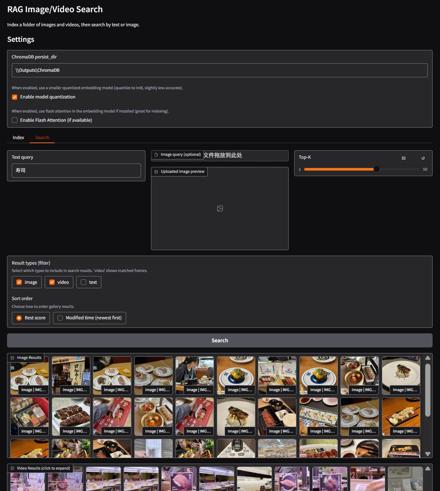

# mizu

An end-to-end Retrieval-Augmented Generation (RAG) workbench for visual and textual media. `mizu` lets you index folders of images, videos, and companion text files into ChromaDB, then explore them through a Gradio-powered web UI with multimodal search.

## Highlights

- **Interactive UI** – single-page Gradio app with dedicated tabs for indexing new media and searching existing collections.
- **Multimodal embeddings** – wraps the `jinaai/jina-embeddings-v4` model to embed text, still images, or sampled video frames.
- **Video-aware search** – extracts representative frames, preserves timestamps, and groups results per source video.
- **HEIF/AVIF friendly** – transparently converts HEIC/HEIF/AVIF images for display while keeping the originals untouched.
- **Optimized indexing** – asynchronous, batched ingestion with optional INT8 quantization and Flash Attention acceleration when the toolchain supports it.

## Requirements

- Python 3.12+
- CUDA-capable GPU strongly recommended (Torch 2.7.0+cu128 is pinned in `pyproject.toml`). CPU-only execution is possible but considerably slower for embeddings.
- Access to the Hugging Face model **`jinaai/jina-embeddings-v4`**. Accept the model license in your Hugging Face account before first use.

Core dependencies are declared in `pyproject.toml` and include ChromaDB, Gradio, Transformers, Torch, OpenCV, BitsAndBytes, and pi-heif.

## Installation

```bash
# 1. Create and activate a virtual environment (venv, uv, conda, etc.)

# 2. Install the project in editable mode
pip install -e .

# If pip cannot locate the CUDA-enabled torch wheel, install it explicitly:
pip install torch==2.7.0+cu128 --index-url https://download.pytorch.org/whl/cu128

# Optional extras for Flash Attention on supported platforms
pip install flash-attn triton-windows>=3.4.0.post20
```

## Run the app

```bash
python app.py
```

After the startup logs, Gradio will display a local URL (and optionally a public share URL). Open it in your browser.

## Indexing workflow

1. Switch to the **Index** tab.
2. (Optional) Pick a custom ChromaDB `persist_dir` if you want to isolate datasets.
3. Point **Folder to index** at a directory containing images (`.jpg`, `.png`, `.heic`, `.avif`, …), videos (`.mp4`, `.mov`, `.mkv`, …), or supported text sidecars (`.txt`, `.md`, `.pdf`, `.docx`).
4. Choose ingestion options:
	- **Add only**: skip already indexed media.
	- **Batch size**: controls embedding batch size (higher = faster, more VRAM).
	- **Limit max frames / Max frames per video / Frame interval**: bound how many frames are sampled per video.
	- **Enable model quantization / Flash Attention** (top-level checkboxes) to balance accuracy vs. speed.
5. Click **Index Folder**. Progress updates stream in the `Stage` textbox and completion stats appear below.

Indexed assets are stored in ChromaDB under `persist_dir`, along with lightweight thumbnails in `persist_dir/thumbnails` and temporary caches for HEIF conversions and extracted video frames.

## Searching the collection

- Use the **Search** tab to submit a text query, an image upload, or both.
- Toggle **Result types** to include image hits, grouped video frame matches, and text documents.
- Switch **Sort order** between best similarity score and most recent modification time.
- Click any gallery tile to see its absolute path; use **Open in file manager** to jump to the source file on your machine.

Video results arrive organized by source file. Selecting a video tile reveals all matching frames with timestamps.

## Advanced notes

- The embedding backend attempts INT8 quantization via BitsAndBytes when enabled; install `bitsandbytes` GPU builds for best performance.
- Optional Flash Attention requires compatible hardware and the `flash-attn` package. The checkbox is ignored when the kernel is unavailable.
- If you frequently work with HEIC/HEIF/AVIF media, the app precomputes temporary JPEG previews under your system temp directory and cleans them up on exit.
- Text files larger than 20 kB are truncated during indexing to keep embeddings manageable.

## Web UI preview



## Troubleshooting

- **Torch wheel errors**: confirm that your CUDA toolkit matches the pinned wheel (`cu128`) or install the CPU-only variant of Torch if you do not have an NVIDIA GPU.
- **BitsAndBytes not found**: reinstall with `pip install bitsandbytes>=0.48.1` and ensure you are using a CUDA-enabled build.
- **Missing model files**: run `huggingface-cli login` and make sure `jinaai/jina-embeddings-v4` is accessible to your account; the first run will download the necessary weights.

## License

Distributed under the terms of the MIT License. See `LICENSE` for details.
